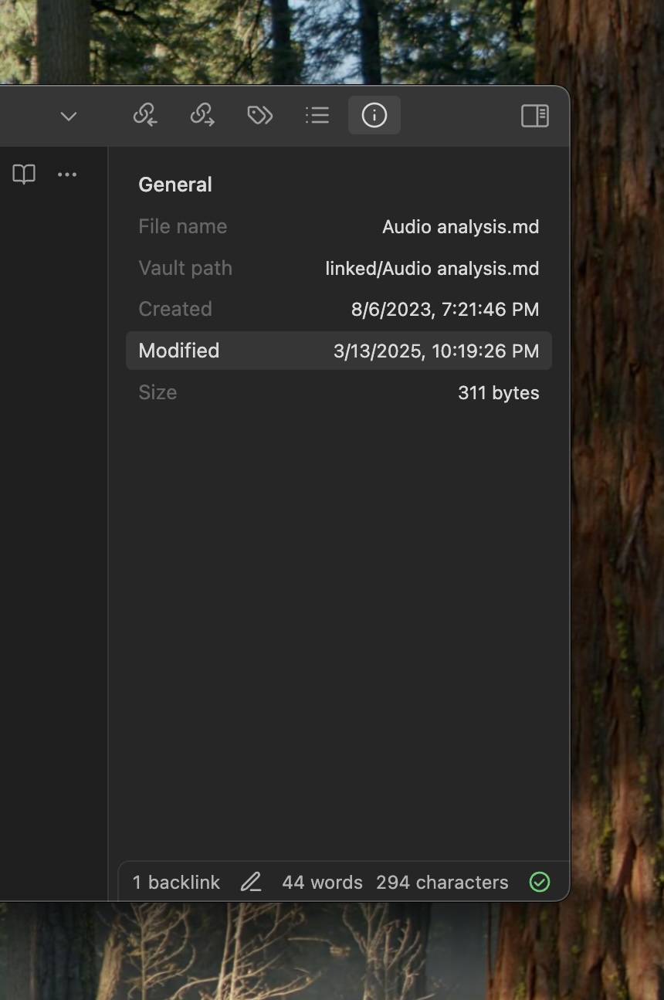
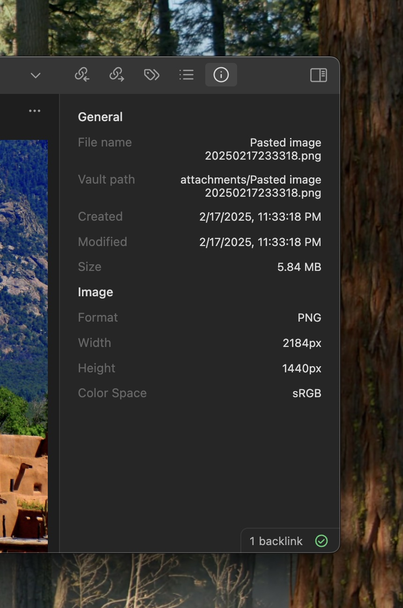

# Simple File Info for Obsidian

File info pane that lives in Obsidian's right sidebar. No more, no less.

The main priorities of this project are:
- *simplicity*: fills the gap for basic file metadata in Obsidian without adding unnecessary bloat
- *native look and feel*: avoids custom styling to feel at home regardless of the theme

### Usage
- the entry point is in the top right sidebar button strip.
- if the pane got dismissed, you can bring it back by executing the "Show file info" command from the command palette.

---

    
    

### Attribution
ExifReader used for basic image info - https://github.com/mattiasw/ExifReader